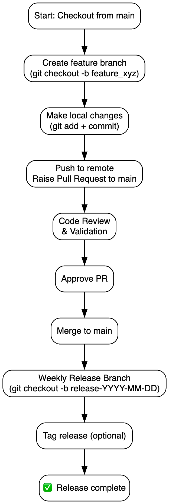

# 🛠️ Git + Docker Compose Cheat Sheet

## 🔀 Branching & PR Workflow



### 🌿 Feature Branch Workflow

```bash
# Start from latest main
git checkout main
git pull origin main

# Create a feature branch
git checkout -b feature_<name>

# Make changes
# Stage & commit
git add .
git commit -m "feat: <your feature description>"

# Push and raise PR
git push origin feature_<name>
# Go to GitHub/GitLab and create PR to `main`
```

### 🔄 Weekly Release Process

```bash
# From main branch
git checkout main
git pull origin main

# Create release branch
git checkout -b release-<YYYY-MM-DD>
git push origin release-<YYYY-MM-DD>

# Tag release (optional)
git tag v<version> -m "Release on <YYYY-MM-DD>"
git push origin v<version>
```

---

## 🐳 Docker Compose Commands

### 🚀 Run the Stack

```bash
docker-compose up         # Start all services
docker-compose up -d      # Start in detached mode
```

### 🧹 Clean & Rebuild

```bash
docker-compose down       # Stop and remove containers
docker-compose build      # Rebuild images
docker-compose up --build # Rebuild and run
```

### 🔍 Debugging & Logs

```bash
docker-compose logs               # View logs for all services
docker-compose logs <service>    # Logs for a specific service
docker-compose exec <service> sh # Shell into a container
```

### ⚙️ Useful Options

```bash
docker-compose ps         # List running services
docker-compose stop       # Stop services
docker-compose restart    # Restart services
```

---

## ✅ Best Practices

* Keep feature branches focused and short-lived.
* Rebase or pull main before pushing to avoid merge conflicts.
* Review PR thoroughly and ensure all checks pass.
* Use `.env` files to manage local configurations.
* Run `docker-compose down -v` to clear volumes if needed.

---


---

> 📌 Tip: Use `git status`, `git diff`, and `git log --oneline` frequently to stay in control of your changes.
